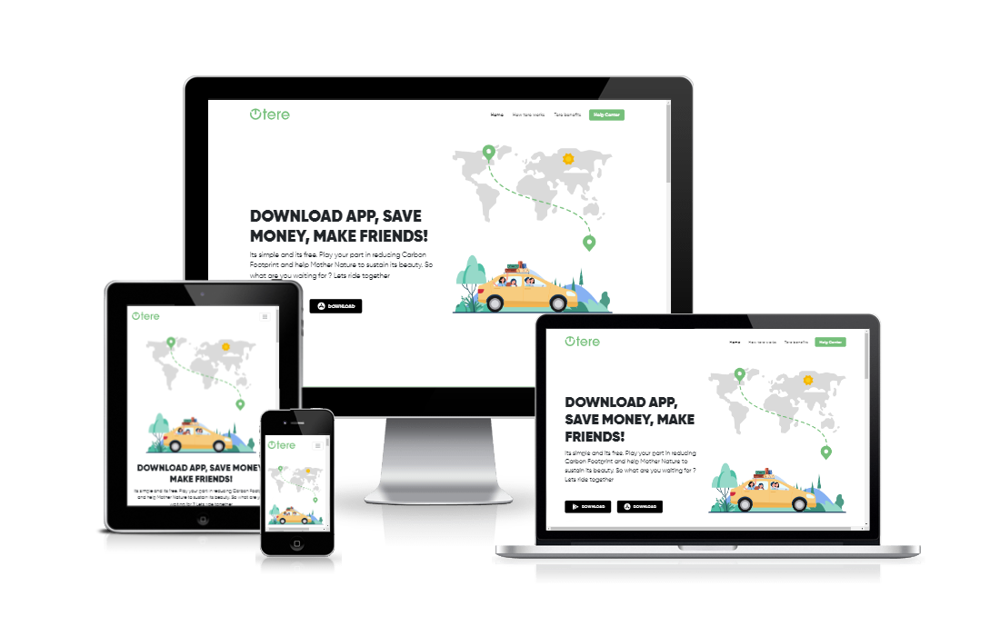

# Tere Theme

A static business/service landing page built based on the Tere template



## Table of Contents

- [Tere Theme](#tere-theme)
  - [Table of Contents](#table-of-contents)
  - [About the Project](#about-the-project)
    - [Description](#description)
    - [Preview](#preview)
    - [Built With](#built-with)
    - [Features](#features)
    - [Usability](#usability)
  - [Getting Started](#getting-started)
    - [Prerequisites](#prerequisites)
    - [Development Mode](#development-mode)
      - [Using Docker](#using-docker)
      - [Using Vite Directly](#using-vite-directly)
    - [Production Build](#production-build)
  - [Credits](#credits)
  - [License](#license)
  - [Demo](#demo)

## About the Project

### Description

This project converted the free [**Figma**](https://www.figma.com/ "Go to website") Tere template into a responsive website, bootstrapped with [**Vite**](https://vitejs.dev/ "Go to website"), built using semantic HTML, [**TypeScript**](https://www.typescriptlang.org/ "Go to website"), and styled with [**Bootstrap**](https://getbootstrap.com/ "Go to website").

In addition, this project serves as a simple practice for implementing [**Docker**](https://www.docker.com/ "Go to website"), [**Docker Compose**](https://docs.docker.com/compose/ "Go to website"), and [**GraphQL**](https://graphql.org/ "Go to website") within a modern development environment.

### Preview

### Built With

[](https://skillicons.dev "Go to Skill Icons")

### Features

- Landing page
- Responsive web design
- Carousel
- Animation on scroll
- Optimized code
- Achieved a PageSpeed score of at least 90
- Dockerized development environment
- Container orchestration using Docker Compose
- GraphQL API integration for handling data

### Usability

All features are usable across modern desktop, tablet, and phone browsers.

## Getting Started

This project is set up to run using **Docker**, allowing for a containerized development environment. You can choose to develop the project using either **Docker** or **Vite** directly, depending on your preference.

### Prerequisites

To clone the project locally, run the following command:

```
git clone https://github.com/basma-khalil/tere.git
```

### Development Mode

You have two options to run the project in development mode:

#### Using Docker

If you'd like to run the project using **Docker** in the development mode, follow these steps:

1. Ensure you have [Docker](https://www.docker.com/products/docker-desktop "Go to website") and [Docker Compose](https://docs.docker.com/compose/install/ "Go to website") installed on your machine.

2. Navigate to the project root directory (where the `docker-compose.yml` file is located).

3. Run the following command to build and start the containers:

```
docker-compose up
```

This will set up the necessary environment and install dependencies inside the Docker container.

4. Once the containers are running, open [localhost:5173](http://localhost:5173 "Go to link") to view the application.

5. To stop the Docker containers, run:

```
docker-compose down
```

By using Docker, you don't need to install Node.js or npm locally, as everything will be handled inside the container.

#### Using Vite Directly

If you prefer to run the project without Docker, you will need [node.js](https://nodejs.org/en/download "Go to website") and npm installed on your local machine.

1. Navigate to the project `app` directory.

2. To install dependencies, run the following command:

```
npm install
```

3. To start the development server, run the following command:

```
npm run dev
```

4. Open [localhost:5173](http://localhost:5173 "Go to link") to view the app in your browser.

### Production Build

To create an optimized build for production, regardless of the development method you used, run the following command in the project `app` directory:

```
npm run build
```

## Credits

- **Author:** you can find Tere template on [UXCRUSH](https://www.uxcrush.com/ride-sharing-figma-website-template/ "Go to website") designed by [Saddam Shadab](https://www.figma.com/@saddamshadab "Go to profile")
- **Libraries:** [AOS](https://michalsnik.github.io/aos "Go to website") | [Apollo Client](https://www.apollographql.com/docs/react "Go to website")
- **Fonts:** [Gilroy](https://www.tinkov.info/gilroy.html "Go to website")

## License

[](https://creativecommons.org/licenses)\
This code is licensed under the **Attribution-NonCommercial-ShareAlike** License - For more details:

- [View License Deed](https://creativecommons.org/licenses/by-nc-sa/4.0/ "Go to website")
- [View Legal Code](https://creativecommons.org/licenses/by-nc-sa/4.0/legalcode "Go to website")

## Demo

For Demo of this template you can visit [tere-theme.vercel.app](https://tere-theme.vercel.app "Go to demo")
